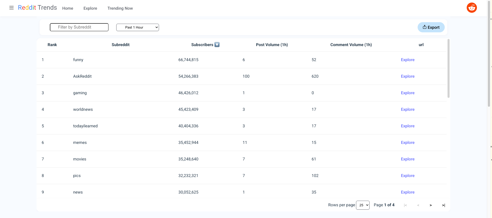
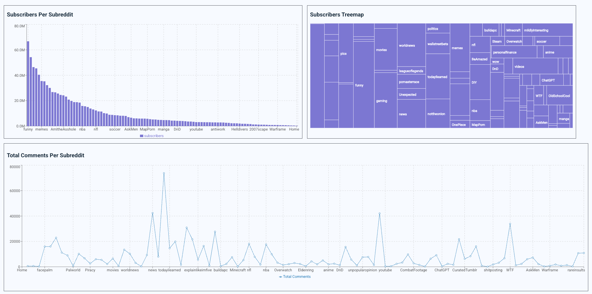

# Introduction
This is the official implementation of my work during the DS 440W Capstone project. The aim of this project is to provide a simple dashboard from scratch utilizing data scraped from Reddit. In addition, the CSS styling was aimed to replicate the format from Google Trend. 




The official website is published at: https://web-trend-1.onrender.com/ 

*Note* The website will take around 20-30 seconds to load

To run the program locally, follow the steps below:

# Frontend
The frontend was developed using React frameowrk. I used Typescript as the programming language.  Once you have downloaded the github repository use the steps below to step up the frontend of the project.

Install the necessary packages to run the frontend.
```shell
cd frontend/
npm install
```
Nex, run an npm audit fix to resolve package issues
```shell
npm audix fix
```

Finally, start up the frontend dev server
```shell
npm run dev
```

*Note* You may notice that the frontend is already populated. This is because the project is setup to run with the backend that has been published. To know how to run this locally, setup MongoDB and Backend.

# MongoDB
Before setting up the backend, setup the MongoDB first. First create an account on MongoDB Atlas and create a cluster. Once you have the cluster setup, create a .env file and add in the following line:

```shell
MONGO_URI=mongodb+srv://<username>:<db_password>@cluster0.woaax.mongodb.net/
```
*Note* Replace the items in <> such as username and db_password with your own. Additionally remove the <> from the sides.

In the output, you should see the output below:
```shell
Server is open: http://localhost:4000
Connected to MongoDB
Pinged your deployment. You successfully connected to MongoDB!
```

Go into the ./frontend/component/UserSubreddit.tsx and replace 
```shell
 const response = await fetch("https://web-trend.onrender.com/api/tofrontend");
```
with
```shell
const response = await fetch("http://localhost:3000/api/tofrontend");
```

# Backend 
Install the necessary packages to run the backend.
```shell
cd backend/
npm install
```
Start the server.js file
```shell
node server.js
```

The program automates the fetch request every hour. To manually fetch, use the following url in order. If the MongdoDB schema is empty, the first url is required for the second url to function correctly
.
```shell
http://localhost:3000/api/subreddit_top

http://localhost:3000/api/subreddit_top

```

